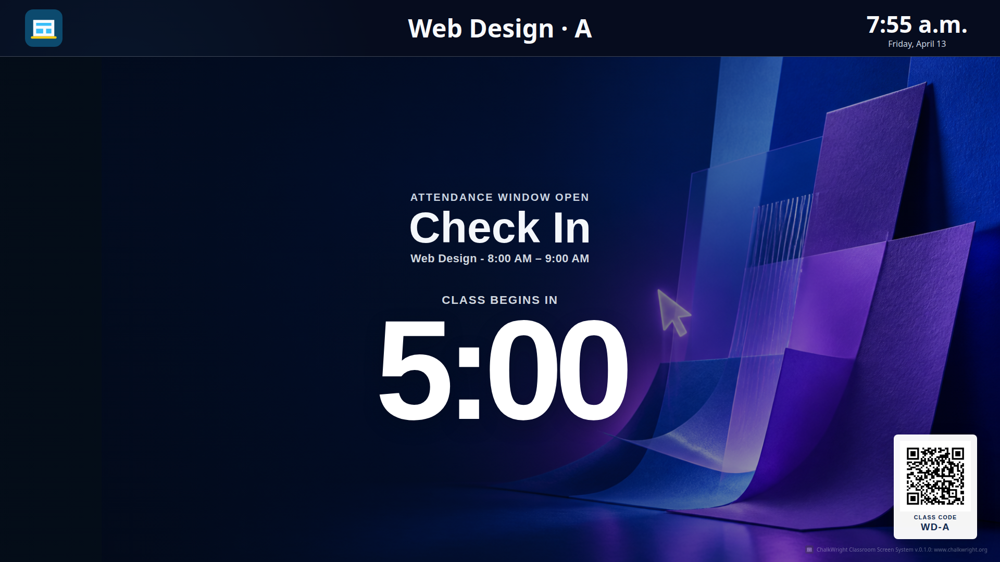

# Chalkwright

Chalkwright is a self-hosted classroom display and day-planning application. It
turns a trusted school schedule into a dependable classroom day plan, keeps the
screen and an application-owned Google Calendar aligned to that plan, and
automatically presents the right information for each stage of the school day.

For each class, Chalkwright can pull upcoming assignment information from
Google Classroom, present a scannable attendance check-in QR code, and augment
the screen with learning objectives, textbook references, vocabulary, and
other lesson materials. The result is a classroom screen that changes with the
schedule instead of acting as a static digital noticeboard.

The project is being extracted from a working classroom automation system into
a self-contained application with typed capability boundaries, SQLite state,
synthetic fixtures, deterministic display behavior, fail-closed provider
adapters, and a tested migration and rollback path.

> **Project status:** pre-release public preview. The offline fixture-backed
> application and migration components are extensively tested. The current live
> display still uses the historical shadow service while the permanent
> Chalkwright production lane is re-grounded. General installation and public
> production deployment are not yet released. See the
> [publication gate](docs/publication-readiness.md) for the exact evidence and
> limitations of this source snapshot.



The screenshot is rendered from the repository-owned synthetic B407 fixture at
a fixed instant and contains no provider or student data. Its reproducible
capture metadata is recorded in
[`docs/assets/classroom-hub-preview.json`](docs/assets/classroom-hub-preview.json).

## What Chalkwright does

- Follows the verified class schedule throughout the day and keeps explicitly
  owned Google Calendar class blocks synchronized without touching unrelated
  events.
- Moves the display through morning preview, check-in, in-class, transition,
  dismissal, gap, and end-of-day views at the appropriate times.
- Reads upcoming Google Classroom coursework and turns relevant assignments
  into concise, class-specific display content.
- Presents a meeting-scoped attendance check-in link and QR code for students
  to scan on their own devices; Chalkwright does not submit attendance to a
  school system.
- Enriches the class carousel with learning objectives, textbook and lesson
  references, vocabulary, reminders, and teacher-configured supporting
  material.
- Offers a rotating word-of-the-day feature, drawing from class-specific and
  subject vocabulary while avoiding immediate repetition.
- Supports configurable class mappings, content cards, vocabulary, attendance
  links, timing policies, media, announcements, overrides, and display-scoped
  controls.
- Previews the next actual class day after the current schedule ends, safely
  skipping weekends and verified no-class days.

## Engineering foundation

- A provider-neutral domain model for schedules, meetings, rooms, screens,
  display states, content, overrides, holds, and Calendar intents.
- A responsive classroom display with beginning-of-day, pre-check-in,
  in-class, ending, gap, post-class, and end-of-day behavior.
- SQLite migrations, integrity checks, backups, retention, restart-safe job
  records, alert checkpoints, and last-known-good state.
- Read-only PowerSchool and Google Classroom boundaries with explicit
  authentication-repair isolation.
- Strong Calendar ownership markers, single-writer leases, durable journals,
  idempotency, receipts, rollback, and bounded qualification workflows.
- Loopback-only HTTP serving, Tailnet-oriented deployment design, hardened
  systemd templates, and rehearsed cutover/rollback ordering.
- A parity-first migration process backed by ADRs, executable contracts,
  synthetic fixtures, browser evidence, and a comprehensive automated test
  suite.

## Safety model

- PowerSchool and Google Classroom are read-only systems.
- Calendar effects are limited to exact configured targets and verified
  application-owned events.
- Preview, comparison, shadow, and report-only paths receive no mutation
  capability.
- Credentials, OAuth grants, browser profiles, provider values, private URLs,
  databases, logs, backups, and student data stay outside Git.
- Configuration is validated before work begins and errors are value-free.
- Provider failures preserve last-known-good display state and fail closed
  before downstream mutation.

See the [architecture principles](docs/architecture-principles.md) and
[security policy](SECURITY.md) for the complete boundary.

## Local fixture-backed demo

### Requirements

- Node.js 24.15.0 or newer
- npm 10 or newer
- Linux is the currently documented deployment target; the offline domain and
  fixture tests are platform-neutral where possible.

### Run

```sh
npm ci
cp .env.example .env
npm run build
npm start
```

The default configuration binds only to `127.0.0.1:4317` and starts the
synthetic fixture-backed display. It does not access a provider, credential,
private route, production database, or Calendar writer.

Open the loopback URL printed by the process. Stop it with `Ctrl+C`.

### Verify

```sh
npm run check:portable
git diff --check
```

`npm run check:portable` validates documentation, synthetic-fixture safety,
operational artifact boundaries, formatting, strict application and browser
types, tests, the production build, startup smoke behavior, and disposable
SQLite rehearsals. Networked provider checks and deployment are deliberately
excluded. Maintainers can additionally use `npm run check` to verify that the
generated tooling index matches the documented deployment host.

## Architecture

```text
read-only sources
      │
      ▼
normalized observations ──► canonical day plan ──► effective screen plan
                                   │                         │
                                   │                         ├─► display state
                                   │                         ├─► preview/holds
                                   │                         └─► local HTTP UI
                                   │
                                   └─► owned Calendar intents
                                              │
                                              └─► guarded writer + journal
```

```text
src/
  app/             process composition and lifecycle
  application/     use cases, normalization, comparison, and orchestration
  config/          exact-shape configuration validation
  contracts/       versioned parity and migration contracts
  domain/          provider- and presentation-neutral behavior
  infrastructure/  SQLite, HTTP, browser, and Google adapters
  ports/           capability-specific interfaces
  presentation/    server-rendered HTML/CSS and browser controller
test/               tests mirroring source boundaries
docs/               product, architecture, ADR, roadmap, and evidence records
systemd/            inert or explicitly gated service/timer artifacts
```

The domain has no transport, browser, SQLite, systemd, or provider dependency.
External integrations are constructed behind narrow typed ports only after
local policy selects an allowed operation.

## Current roadmap position

Milestones M-01 through M-16 are recorded as promoted. M-17's isolated
parallel-canary evidence supported the permanent handoff, and the standalone
Chalkwright production lane now serves the existing classroom URL and display
mount. Its immutable releases follow protected GitHub `main`; the display,
read-only PowerSchool and Classroom acquisition, offline glossary catalog,
owned-Calendar reconciliation, integrity, backup, and deployment timers are
active. Physical classroom use has accepted the course labels, stable polling,
future-class-day preview, Classroom enrichment, and multilingual vocabulary.

The historical shadow service remains active only as an available rollback
reference; it is not the display's source of truth or current serving path.
Google Calendar remains a follower of Chalkwright's local canonical plan.

M-17 used an isolated parallel canary with:

- a separate Tailnet-only URL;
- a separate owned Calendar from the legacy application;
- separate services, timers, state, backups, leases, and journals;
- staggered read-only provider acquisition; and
- report-only candidate alerts.

Those parallel-canary controls remain documented as historical handoff and
rollback evidence. The active roadmap is now stabilization, recovery proof,
remaining enrichment slices, and an explicitly approved M-18 retirement of the
retained legacy fallback. See the [migration plan](docs/migration-plan.md),
[future parity roadmap](docs/future-parity-roadmap.md), and [M-17 review
package](docs/migration/m17-review-package.md).

## Configuration direction

The current strict runtime schemas are security contracts, not the intended
end-user authoring experience. After the initial deployment is stable, the
project will provide a versioned human-facing non-secret configuration and
guided setup for providers, rooms, screens, mappings, schedules, and Calendar
targets. It will generate the protected runtime files while keeping OAuth,
tokens, browser profiles, and private provider values separate.

The goal is an approachable self-hosted application that a teacher or school
implementer can customize without editing TypeScript, systemd units, or
generated JSON.

The public product and repository name is now **Chalkwright**. Existing
`CLASSROOM_HUB_*` environment keys, service accounts, filesystem paths, URLs,
and ownership markers remain compatibility contracts during the pre-release
migration. They will move through an explicit, tested deprecation path rather
than a risky wholesale rename. Historical migration records retain the name
they had when the evidence was produced.

## Optional dismissal media

The public source distribution contains an authored poster fallback but no
playable dismissal video. A site that owns or licenses a video may add an
optional `dismissalMedia` object to its protected production-server JSON with
an absolute external `path`, exact `byteLength`, and lowercase SHA-256
`sha256`. Chalkwright rejects symlinks, hard links, size drift, invalid MP4
signatures, and digest drift. When the field is absent, the display remains
healthy and reveals the poster fallback instead.

## Documentation

- [Product vision](docs/product-vision.md)
- [Architecture principles](docs/architecture-principles.md)
- [Migration strategy](docs/migration-strategy.md)
- [Migration roadmap](docs/migration-plan.md)
- [Architecture decisions](docs/decisions/README.md)
- [Legacy parity inventory](docs/legacy-parity-inventory.md)
- [Migration evidence index](docs/migration/README.md)
- [Engineering standards](docs/engineering-standards.md)
- [Operations guide](docs/operations.md)
- [Configuration guide](docs/configuration.md)
- [Publication readiness gate](docs/publication-readiness.md)
- [Public history plan](docs/publication-history-plan.md)
- [Third-party notices](THIRD_PARTY_NOTICES.md)
- [Changelog](CHANGELOG.md)

## Contributing

Chalkwright is not accepting general production-deployment claims while it is
in public-preview preparation, but focused fixes, tests, documentation, fixture
improvements, portability work, and safety reviews are welcome once the
repository is published. Read [CONTRIBUTING.md](CONTRIBUTING.md) and
[SECURITY.md](SECURITY.md) before opening a change.

Never include real student data, credentials, OAuth material, browser state,
provider responses, private routes, or live configuration in an issue, test,
fixture, or pull request.

## License

Chalkwright is licensed under the
[Apache License, Version 2.0](LICENSE). The license includes an explicit patent
grant from contributors. Third-party dependencies and gated site media are
documented separately in [THIRD_PARTY_NOTICES.md](THIRD_PARTY_NOTICES.md).
