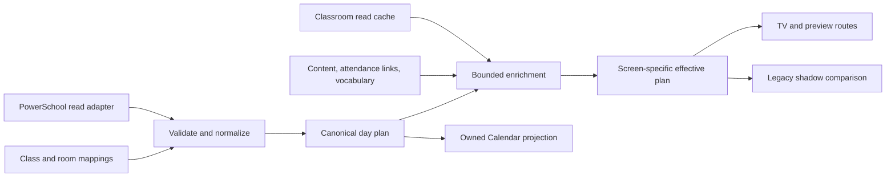

# Architecture principles

## How to use this document

The first section contains enduring constraints that should survive library,
schema, and deployment changes. The second section records accepted or
proposed implementation choices. Implementation choices may change through an
ADR without weakening the enduring principles.

## Enduring principles

### 1. Explicit sources of truth

- PowerSchool-derived schedule and bell data owns school-day timing and mapped
  course/room identity.
- Chalkwright's canonical day plan owns the application's normalized view of
  a day after mappings, validation, and approved local policy are applied.
- Google Classroom is read-only enrichment, never schedule authority.
- Google Calendar is a projection of owned portions of the canonical day plan,
  never the internal source of truth.
- Application configuration owns local timing and presentation policy.
- Lockfiles and detected runtime state own software-version facts; generated
  documentation must not contradict them.

### 2. A canonical day plan separates acquisition from presentation

Adapters produce typed observations with provenance. Domain code produces a
canonical plan without I/O. Screen-specific overlays produce effective plans.
Calendar and display rendering consume those plans independently.

### 3. Boundaries are enforceable, not conventional

- PowerSchool and Classroom adapters expose read operations only.
- Calendar commands require a verified ownership predicate and a writer lease.
- Preview and comparison modes are structurally unable to invoke mutation
  ports.
- Authentication observation, explicit repair, acquisition, normalization,
  persistence, presentation, Calendar projection, and operations are separate
  modules with explicit contracts.
- Passive PowerSchool acquisition exposes only bounded same-origin read methods;
  it cannot submit forms or invoke the separate interactive repair capability.
- PowerSchool date serialization is an adapter-edge contract: ISO remains the
  default synthetic format, while a finite approved tenant surface may opt into
  validated `MM/DD/YYYY` query values without exposing arbitrary query keys or
  URLs.
- Transitional legacy adapters implement the same ports and are removable
  without changing the domain model.

### 4. Ownership precedes mutation

Calendar events, overrides, holds, screens, rooms, imported records, and job
runs carry stable application ownership and scope. Calendar ownership requires
an unambiguous application marker plus the configured calendar/scope; title or
description heuristics alone are insufficient for new writes. Ambiguous legacy
events are quarantined for comparison or explicit adoption, never silently
claimed.

### 5. Privacy by minimization

Persist only fields required for classroom behavior, reconciliation,
provenance, and audit. Raw PowerSchool captures, browser cookies, OAuth tokens,
roster exports, response bodies, and unnecessary student fields remain outside
the application database. Logs, metrics, alerts, manifests, and comparison
reports use counts, opaque identifiers, and redacted errors.

### 6. Failure isolation and last-known-good service

- Upstream reads and Calendar work never sit on the TV request path.
- The display reads a committed effective-plan snapshot and retains the last
  valid response through transient failures.
- Invalid or stale input degrades readiness with precise diagnostics but does
  not erase a last-known-good plan.
- Classroom refresh failure retains the previous cache and uses bounded retry
  backoff.
- One integration failure does not corrupt unrelated integration state.
- Startup fails closed for unsafe configuration, schema, ownership, or writer
  conflicts while allowing diagnostic endpoints where safe.

### 7. Idempotency and deterministic comparison

Canonical records have stable identities. Equivalent inputs produce equivalent
plans and Calendar intents. Writes occur in transactions; semantic no-ops are
recognized only after the stored payload, hash, identity, and scope validate.
Job attempts, input fingerprints, output fingerprints, latest-state references,
and side-effect receipts support replay and comparison without duplicate
effects. Calendar state advances only when those values, a date-bearing complete
scope, a matching requested date, and a clean successful result with every
attempted mutation completed all agree.

### 8. Authentication failure is a mutation gate

All required source reads and authentication checks complete before Calendar
mutation planning is promoted to execution. A repair-required, expired,
ambiguous, or partial authentication result produces a failed/skipped run with
zero Calendar mutations. Authentication repair remains an explicit operator
action unless a separately approved unattended mechanism is proven safe.

### 9. Configuration has one precedence model

From lowest to highest precedence:

1. versioned safe defaults;
2. repository-owned non-secret configuration;
3. imported continuity configuration after validation;
4. deployment environment variables or environment files;
5. explicit operator overrides obtained through the edition-appropriate access
   boundary and scoped by screen/date/class.

Secrets are references, not configuration values. Effective configuration is
inspectable in redacted form and records its provenance.

The current strict runtime schemas are security and execution contracts, not
the eventual end-user authoring experience. A future distribution layer should
offer one versioned human-facing non-secret configuration and guided setup,
then validate and generate the exact protected runtime references and service
inputs. Generated files must remain inspectable and deterministic; the setup
layer may not weaken ownership, path, capability, provider, or Calendar-target
validation. Secrets and OAuth/browser state remain separate and are never
embedded in portable configuration exports.

The accepted A05
[Core configuration and durable-state contracts](core-configuration-state-contracts.md)
make this future boundary executable: immutable validated revisions, an atomic
active pointer, expected-version conflicts, bounded protected references,
redacted portable exports, protected-backup manifests, and checksum-bound
forward-only migration/rollback decisions are adapter-neutral. Full workspace
identity includes kind and installation/organization identity rather than only
the namespace ID, and successful executable-contract outputs detach canonical
JSON snapshots from caller-owned objects. They are not yet threaded through the
current runtime or SQLite schema.

The completed A06
[Core source-mode contracts](core-source-mode-contracts.md) extend the same
boundary to source definitions and normalized projections. Formats and budgets
are closed, exact workspace identity is mandatory, URLs and files confer no
authority, provider grants are read-only and resource-specific, and only a
whole-input-and-projection verified observation may replace committed state.
Failed bounded refresh retains the exact last-known-good projection while
freshness degrades or becomes stale. The contracts do not implement current
adapters, persistence, or provider enrollment.

### 10. Screens and rooms are isolated first-class entities

A room describes the physical/classroom context. A screen describes a client,
route, effective configuration, active hold, and health. Every plan, override,
hold, readiness result, and route lookup is scoped explicitly; a missing scope
must not fall back to another room. B407 is the first validation target, not a
hard-coded global singleton. Persistence permits one current canonical plan per
date/room and one current effective plan per date/screen; effective reads also
carry the screen's expected room so recovery cannot cross a reassignment.
Server holds additionally require date, screen, meeting, and effective-plan
identity. Release, safety expiry, meeting changes, and stale-plan invalidation
create auditable revisions; optimistic revision checks prevent concurrent
operators from silently overwriting a newer transition. A terminal release or
expiry may begin a new held lifecycle only through the current revision, so a
repeat operator command does not discard audit history or bypass concurrency.

### 11. Observability follows user outcomes

Health reports process viability; readiness reports whether safe, fresh enough
plans and required media/configuration are available. Job records distinguish
skipped, degraded, failed, and successful outcomes. Alerts deduplicate a stable
issue fingerprint, repeat only after policy allows, and emit recovery. Metrics
and logs never substitute for parity comparison of actual plans and display
states.

### 12. Upgrade resilience is designed in

External payloads are normalized behind adapters, stored contracts are
versioned, migrations are forward-only with backups, and APIs evolve
compatibly through initial cutover. Version-sensitive behavior is checked
against locked/runtime versions and canonical documentation. A dependency or
browser upgrade must pass fixtures, parity tests, and a read-only shadow check
before promotion.

Code rollback may reuse current state only when the exact predecessor manifest
declares that schema readable. Otherwise rollback restores the exact verified
pre-migration protected backup in isolation before selecting the predecessor;
there is no down-migration path.

## Implementation choices and status

| Choice                                              | Status                                  | Rationale                                                                                                                                                                                                                                                           |
| --------------------------------------------------- | --------------------------------------- | ------------------------------------------------------------------------------------------------------------------------------------------------------------------------------------------------------------------------------------------------------------------- |
| Host-native Node.js/TypeScript                      | Accepted                                | Matches the target host and removes unrelated runtime layers.                                                                                                                                                                                                       |
| SQLite for application state                        | Accepted                                | One-host transactional state, queries, migrations, and audit history without a network database.                                                                                                                                                                    |
| Built-in `node:sqlite` on Node.js 24.15.0 or newer  | Accepted                                | Supplies the required synchronous transaction and asynchronous backup APIs without another dependency; SQLite remains infrastructure-only.                                                                                                                          |
| Credentials and browser profiles outside SQLite/Git | Accepted                                | Separates high-risk material from application backup and migration paths.                                                                                                                                                                                           |
| Repository-owned systemd services/timers            | Accepted                                | Makes scheduling and process ownership independent of OpenClaw.                                                                                                                                                                                                     |
| Tailscale Serve and loopback backend                | Accepted                                | Uses a separate Tailnet-only canary URL before the existing TV URL is changed at a separately approved final handoff.                                                                                                                                               |
| One writer per exact Calendar scope                 | Accepted                                | The canary and legacy app may run concurrently only on disjoint bound Calendars; two writers may never target the same Calendar.                                                                                                                                    |
| Server-controlled carousel holds                    | Accepted                                | Holds survive reload and are scoped/auditable.                                                                                                                                                                                                                      |
| Initial server-rendered UI/controller strategy      | Accepted                                | Bounded HTML/CSS/TypeScript views meet the offline B407 scope and first Core operator-panel goal without a framework or client bundler; ADR-0009 records both verification gates.                                                                                   |
| Direct PowerSchool browser/auth implementation      | Accepted                                | Exact `playwright-core` with installed Chrome supplies protected-profile and dynamic-page support; ordinary acquisition is same-origin GET-first, mechanically read-only, and separate from explicit repair (ADR-0010).                                             |
| Direct Google client/credential mechanism           | Proposed                                | Needs a least-privilege, read/write-scope review and fixtureable adapter.                                                                                                                                                                                           |
| Public Core and commercial boundary                 | Accepted with deferred hosted selection | Core retains private operator/display authority and never exposes its unauthenticated routes as a hosted control plane. Direct TypeScript-package reuse is the current candidate; D00 may select a versioned worker/service or Python port after Goal 1 (ADR-0026). |
| Alert delivery transport                            | Proposed                                | Legacy semantics are known; steady-state transport/ownership is not yet approved.                                                                                                                                                                                   |

See the [ADR index](decisions/README.md) for context, alternatives,
consequences, reversibility, and verification implications.
